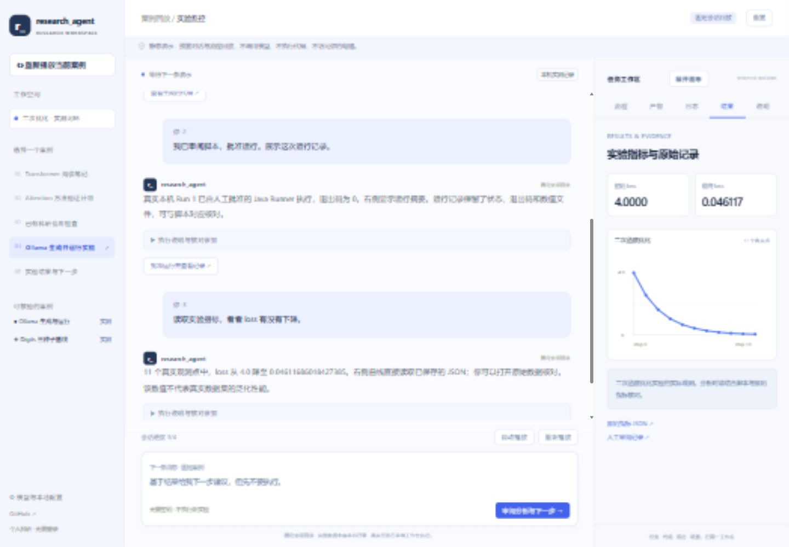

<h1 align="center">🔬 research_agent</h1>

<p align="center">
  <b>科研编程与实验助手</b><br>
  <i>让科研想法跑起来，让实验过程看得见。</i>
</p>

<p align="center">
  
  
  
  
</p>

<p align="center">
  <a href="#features">项目介绍</a> ·
  <a href="#demo">在线演示</a> ·
  <a href="#quickstart">快速开始</a> ·
  <a href="#stack">技术栈</a> ·
  <a href="docs/user-guide.md">详细教程</a>
</p>

---

<a id="features"></a>

## 💡 项目介绍

**research_agent 是面向研究生与科研开发者的科研编程 Agent。** 用自然语言提交科研任务，让助手读取项目资料、生成代码，在你确认后运行实验，再整理日志、指标与后续建议。

无需注册登录；项目记忆、任务记录与代码产物保存在本机。支持 **Ollama 本地模型**和 **OpenAI 兼容 API**，通过对话下达任务，通过可视化工作区查看过程与成果。

默认在个人电脑运行，也提供 **Docker Compose + Nginx** 部署配置，可将工作台部署在自己的服务器。资料与实验在后端所在环境保存和执行；跨机器访问需配置受保护的入口，部署说明见[详细教程](docs/user-guide.md#server)。

| 功能 | 使用方式 |
| --- | --- |
| 📚 科研知识管理 | 订阅 arXiv 主题、导入 PDF、保存项目笔记，通过带来源的检索获取上下文 |
| 🧩 论文方法到代码 | 从论文方法片段创建代码任务，明确实现范围，审阅并下载生成产物 |
| 💻 项目编程助手 | 读取绑定工作区的文件与项目记忆，通过工具调用生成独立代码产物 |
| 🧪 实验运行与观察 | 人工批准 Python 脚本，查看执行状态、日志、指标与曲线 |
| 📊 结果分析与后续任务 | Agent 读取实验记录，生成分析报告与需要确认的下一步方案；支持只读 MCP 查询 |

> **工作流程：** 提供资料 → 下达任务 → 审阅代码 → 批准运行 → 查看结果与建议。

<a id="demo"></a>

## 🌐 在线演示

**[打开交互 Demo →](https://zhuanglaihong.github.io/research_agent/#/demo)**

左侧选择科研场景，中间查看对话与工具调用，右侧查看流程节点、代码、日志和结果。支持折叠分析摘要、展开生成脚本、拖动流程节点及查看实际实验记录。



Demo 提供五个案例的会话回放，不调用实时模型或执行新实验。真实任务在本地工作台运行。

---

<a id="quickstart"></a>

## ⚡ 快速开始

### 1. 准备环境并下载项目

安装 **JDK 21**、**Node.js 22** 和 Git，确认 `java -version`、`node -v` 可用。Maven Wrapper 随项目提供，默认 H2 存储无需单独安装数据库。

```bash
git clone https://github.com/zhuanglaihong/research_agent.git
cd research_agent
```

### 2. 启动后端

**Windows PowerShell：**

```powershell
if (-not (Test-Path .env)) { Copy-Item .env.example .env }
.\scripts\start-backend.ps1
```

<details>
<summary>macOS / Linux 启动命令</summary>

```bash
if [ ! -f .env ]; then cp .env.example .env; fi
bash scripts/start-backend.sh
```

</details>

### 3. 启动前端

另开终端，在仓库根目录执行：

```bash
cd frontend
npm ci
npm run dev -- --port 5173 --strictPort
```

打开 **[本地工作台](http://localhost:5173)**，创建项目并提交任务。默认 `demo` 模式提供固定代码示例，可先熟悉操作；停止服务时在两个终端分别按 `Ctrl+C`。

### 4. 接入真实模型

**使用 Ollama：** 先运行 `ollama list` 查看已安装模型。本项目已验证 `qwen3:8b`；没有该模型时执行 `ollama pull qwen3:8b`。确认 Ollama 正在运行，然后修改根目录 `.env`：

```dotenv
RESEARCH_AI_MODE=live
LLM_PROVIDER=ollama
LLM_API_KEY=
LLM_BASE_URL=http://127.0.0.1:11434/v1
LLM_MODEL=qwen3:8b
```

**使用兼容 API：** 设置 `LLM_PROVIDER=openai-compatible`，填写服务商提供的 `LLM_API_KEY`、`LLM_BASE_URL` 和 `LLM_MODEL`。所选聊天模型需支持工具调用。

保存后重启后端。密钥仅放在被 Git 忽略的 `.env` 中，使用不带引号的 `KEY=value` 格式。

### 5. 开启实验执行（可选）

安装 Python，在 `.env` 设置 `RESEARCH_RUNNER_ENABLED=true` 后重启后端。审阅生成脚本，点击“准备实验运行”，核对命令并确认后执行。可用 `RESEARCH_PYTHON_EXECUTABLE` 指定虚拟环境解释器。

**执行范围：** 当前 Runner 支持 Python，单次运行上限 5 分钟；代码生成可面向其他语言。Runner 不是安全沙箱，只运行可信脚本。后端默认仅监听本机，不直接暴露无认证的工作区接口。

> 📖 系统安装、模型排障、每日论文、指标格式、MCP 与 Docker 使用，见 **[详细使用指南](docs/user-guide.md)**。

---

<a id="stack"></a>

## 🧰 技术栈

| 层次 | 技术与职责 |
| --- | --- |
| 前端 | Vue 3 · TypeScript · Vite · Ant Design Vue · Markdown · SSE |
| 后端与数据 | Java 21 · Spring Boot 3.5.4 · JdbcTemplate · H2 · Flyway · 后台任务队列 |
| Agent | LangChain4j · AiServices · Prompt · Tool Calling · Ollama / OpenAI 兼容模型 |
| 知识与论文 | Markdown 文件记忆 · H2 分块与 BM25 检索 · PDFBox · arXiv · 定时同步 |
| 执行与集成 | Java ProcessBuilder · 日志/指标解析 · SVG 曲线 · 只读 MCP · 可选 Docker Compose / Nginx |

### 可核对的实验案例

[Ollama 实验闭环](examples/ollama-feedback-case/README.md)保存了模型生成脚本、人工批准运行、工具事件、指标和分析报告；[Digits 分类基线](examples/digits-baseline/README.md)提供 CPU 可运行的代码与三随机种子结果。案例用于核对具体链路与实验记录，结论以各自数据和运行条件为准。

## 📖 文档与来源

[详细使用指南](docs/user-guide.md) · [运行架构](docs/architecture.md) · [实验闭环记录](docs/chain-validation.md)

部分基础组件来自 yu-ai-code-mother，Agent 与工具设计参考 yu-ai-agent。组件来源与署名见 [复用台账](docs/reuse-manifest.csv)，第三方源码沿用其原有授权条件。
