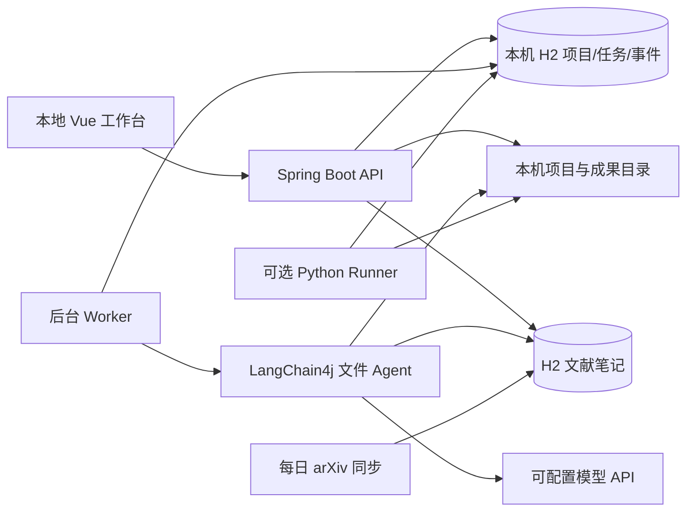

<h1 align="center">research_agent</h1>

<p align="center">
  <b>本地科研编程助手</b><br>
  创建科研项目，用自然语言下达代码任务，查看进度并保存成果。
</p>

<p align="center">
  <a href="#features">主要功能</a> ·
  <a href="#quickstart">快速开始</a> ·
  <a href="#stack">技术栈</a> ·
  <a href="#platforms">系统配置</a> ·
  <a href="#demo">在线演示</a>
</p>

> **当前阶段：本地单用户架构 MVP。** 下载后无需注册或登录，默认不需要 MySQL、Redis、Docker、Python 或 GPU。启动需要 JDK 21；使用 Web 界面还需要 Node.js 22。默认 `demo` 模式可验证任务流程，真实模型生成需配置 API 密钥。项目记忆、本地分块 BM25 检索、文本型 PDF 导入、arXiv 主题订阅和可选 Python 实验运行已实现首版；向量检索、MCP、自动调参和论文级绘图仍在规划中。

## 📑 导航

1. [定位、已实现功能和体验流程](#features)
2. [快速开始与模型配置](#quickstart)
3. [实际技术栈与运行架构](#stack)
4. [Windows、macOS、Linux 环境配置](#platforms)
5. [在线演示、验证与后续计划](#demo)

---

<a id="features"></a>

## 💡 定位与已实现功能

`research_agent` 面向个人科研工作：管理本地项目、描述代码需求、审阅任务步骤，再由 Agent 读取项目文件并生成独立的代码产物。模型负责推理与生成；项目负责把工作区、后台任务、过程记录和成果放在一起。

| 能力 | 现在能做什么 | 边界 |
| --- | --- | --- |
| 本地项目 | 创建项目、选择主要语言、查看项目目录 | 默认在 `data/workspaces/1/` 中建目录；显式路径也必须在该目录内 |
| 自然语言任务 | 输入需求、审阅固定步骤、批准或取消 | 步骤仍是模板，不是模型自主制定研究计划 |
| 科研编程 Agent | 列出和读取项目文件，通过工具生成代码、配置和说明 | 当前不会运行、测试或覆盖原项目代码 |
| 任务与进度 | 后台队列、状态事件、断线后查看历史、总结 | 单后端实例；重启时运行中的任务标为中断 |
| 项目记忆 | 在工作区保存和编辑 `.research_agent/memory.md`，任务生成时读取 | 用户自行维护，不会自动概括全部历史 |
| 科研知识库 RAG | 保存笔记、arXiv 摘要和 PDF 文本；项目内分块 BM25 检索，显示来源与片段编号，可删除资料 | 本地关键词相关性，不是向量语义检索 |
| 每日论文 | 设置英文研究主题，手动或每天 08:00 从 arXiv 拉取最新元数据与原始摘要，去重并加入项目检索 | 不下载 PDF；尚未自动提炼创新点或评价论文质量 |
| 论文到代码入口 | 上传文本型 PDF，抽取并审阅方法原文片段，创建带来源、语言与复现交付要求的待确认任务；arXiv 摘要也可草拟任务 | 演示模式只生成固定样例；真实论文复现需模型、人工核对与实验验证 |
| 实验助手 | 可选开启 Python Runner；人工确认后运行脚本，查看状态、日志、数值指标和 SVG 曲线，基于实际记录草拟分析任务 | 默认关闭；5 分钟/1 MB 日志限制；无系统沙箱，不会自主改参或重启实验 |
| 成果 | 浏览生成文件、下载 ZIP | 每项任务使用独立产物目录 |

**当前不需要账号。** 本机用户打开界面即可使用。数据保存在本机文件；`user_id=1` 是兼容旧数据库结构的内部值，不表示有用户系统。服务只应监听本机，不能把无认证的工作区接口直接暴露到公网。

### 使用示例

1. 打开项目页，创建“图像分类基线”，工作区路径留空。
2. 进入工作台，输入：“读取项目，生成 PyTorch 训练与验证脚本，并写出未验证的假设”。
3. 在项目记忆中写研究约束、添加带来源的笔记或设置 arXiv 主题；审阅并批准任务，查看检索事件、阶段进度、代码和总结。需要运行 Python 代码时显式开启 Runner，并再次确认具体脚本。

默认 `demo` 模式生成固定的 Python/Go 示例，不调用模型。`live` 模式可按要求生成其他语言的代码，具体质量取决于所用模型；生成代码不等于论文复现成功。

### 可选：本机运行生成的 Python 脚本

安装 Python 并确认 `python --version` 后，在 `.env` 设置 `RESEARCH_RUNNER_ENABLED=true`，重启后端。在任务产物中检查脚本，然后点击“准备实验运行”，核对命令与工作目录，确认后才会启动进程。可用 `RESEARCH_PYTHON_EXECUTABLE` 指定 Python 解释器。Runner 不通过 shell 拼接命令，限制单次运行 5 分钟、日志总量 1 MB；它仍不是安全沙箱，勿运行不可信代码。其他语言的生成不受影响，但当前 Runner 只支持 Python。

脚本可在任务产物目录写 `metrics.jsonl`（每行如 `{"step":1,"loss":0.5,"accuracy":0.8}`）或 `metrics.csv`（首行 `step,loss,accuracy`）。实验助手每秒读取本次运行的数值，最多取 1 MB、1000 行和 8 个指标；网页显示起始值、最新值、观测最优值，并可下载独立 SVG 曲线。统计摘要只描述已有数据，不判断模型是否真正优于基线。可以将摘要与日志草拟为下一项分析任务，仍需人工确认。

### 可选：每日论文

在项目工作台“每日论文”中填写英文主题并保存；可立即同步，也可打开每日 08:00 自动同步。自动同步只拉取 arXiv Atom 元数据、标题、链接和原始摘要，新论文自动加入项目笔记检索。也可手动上传文本型 PDF（10 MB、100 页以内），查看抽取的方法原文片段，再创建待确认的代码任务。扫描件需先 OCR；公式、图表和方法解释仍需人工核对。每次同步最多抓取 5 篇，并在连续请求间至少等待 3 秒。

---

<a id="quickstart"></a>

## ⚡ 快速开始：本机直接运行

### 1. 安装 JDK 21 与 Node.js 22

在终端确认：

```text
java -version   # 21
node -v         # v22.x
npm -v
```

项目自带 Maven Wrapper，无需安装全局 Maven。安装平台与 CPU 架构的具体选择见[系统配置](#platforms)。

### 2. 准备环境文件

在仓库根目录首次复制示例文件；已有 `.env` 时保留原文件。

Windows PowerShell：

```powershell
cd D:\project\Agent\research_agent
if (-not (Test-Path .env)) { Copy-Item .env.example .env }
```

macOS / Linux Bash：

```bash
cd /path/to/research_agent
if [ ! -f .env ]; then cp .env.example .env; fi
```

`.env.example` 默认是 `RESEARCH_AI_MODE=demo`。`.env` 被 Git 忽略，密钥不要放进前端或提交到仓库。启动脚本读取简单 `KEY=value`，请勿使用引号、行内注释或变量展开。

### 3. 启动 Java 后端

Windows PowerShell，在仓库根目录：

```powershell
.\scripts\start-backend.ps1
```

macOS / Linux Bash：

```bash
bash scripts/start-backend.sh
```

Windows 脚本在当前开发机上可发现相邻目录的便携 JDK；这个 JDK 不随仓库分发，其他电脑需要安装 JDK 21。后端默认监听 `127.0.0.1:8123`，首次运行会在 `data/research_agent.mv.db` 创建本地数据库，Flyway 自动建表。`data/` 不提交到 Git。

已有打包 jar 时，Windows 可运行 `./scripts/smoke-demo.ps1 -EnableRunner -SyncPapers` 做独立端到端演示：脚本临时在 18123 端口启动后端，使用独立 H2 数据库创建项目、记忆、笔记和任务，检查检索事件、Python 执行、arXiv 同步与产物，然后停止脚本创建的进程。省略两个开关可只验证离线任务链路。运行前先执行 `./mvnw.cmd -B -ntp verify`。

### 4. 启动 Vue 前端

另开一个终端：

```bash
cd frontend
npm ci
npm run dev -- --port 5173 --strictPort
```

依赖已安装且锁文件未改变时可省略 `npm ci`。打开 **http://localhost:5173**；无需注册登录。Vite 会把 `/api` 转发给本机后端。API 文档在 http://localhost:8123/api/doc.html，能力状态在 http://localhost:8123/api/research/health。停止时分别在两个终端按 `Ctrl+C`。

### 5. 开启真实模型生成（可选）

在根目录 `.env` 填入你自己的兼容 OpenAI 协议、支持工具调用的模型信息，然后重启后端：

```dotenv
RESEARCH_AI_MODE=live
LLM_API_KEY=your-private-key
LLM_BASE_URL=https://api.deepseek.com
LLM_MODEL=deepseek-chat
```

默认地址和模型只是配置示例，真实调用及生成质量要用你自己的密钥验证。前端不持有密钥。`demo` 和 `live` 当前都只生成代码，不执行训练。

---

<a id="stack"></a>

## 🧰 实际技术栈

| 部分 | 当前主链路 | 职责 |
| --- | --- | --- |
| 界面 | Vue 3、TypeScript、Vite、Ant Design Vue、Axios、SSE | 项目、任务、进度与成果展示 |
| 后端 | Java 21、Spring Boot 3.5.4、JdbcTemplate、Flyway | 本地 API、文件边界、任务与后台 Worker |
| Agent | LangChain4j、Prompt、AiServices、文件 Tool Calling | 在限定工作区读取上下文、写入任务成果 |
| 项目知识 | 工作区 Markdown 记忆、H2 文档与分块、BM25 | 按任务找相关片段并附来源，形成首版本地 RAG |
| 论文源 | Java HttpClient、arXiv Atom API、Spring 定时任务、PDFBox 3.0.5 | 主题订阅、摘要入库、文本型 PDF 抽取 |
| 实验运行 | Java ProcessBuilder、H2 运行记录、指标解析、SVG | 人工确认后执行 Python 脚本，监看日志与数值并导出曲线 |
| 本地数据 | 嵌入式 H2 文件数据库、工作区目录 | 保存项目、任务、事件和生成文件；不需要单独启动数据库服务 |
| 构建与验证 | Maven Wrapper、JUnit、Vue 类型检查；可选 Docker Compose + Nginx | 构建、集成测试与本机容器体验 |

**没有进入当前科研主链路：** Spring AI、LangGraph4j、Redis、PgVector/其他向量数据库、MCP、ECharts。当前 RAG 将笔记、arXiv 摘要和 PDF 文本按约 900 字符重叠分块，持久化到 H2 并在项目范围内用 BM25 检索；结果带文档与片段编号，进入 Agent 提示词及工具结果。PDFBox 负责文本型 PDF 抽取；尚无嵌入模型、语义向量或混合排序，不需要外部数据库。旧网站生成、管理员、截图和对象存储模块已从主代码移除。

### 运行架构



任务状态是 `WAITING_APPROVAL → QUEUED → RUNNING → SUCCEEDED/FAILED`，并支持取消。关闭浏览器不会取消后台生成或实验运行；重启服务时，运行中的记录标为 `INTERRUPTED`，不会自动恢复。文件工具拒绝越界路径和符号链接，生成结果单独存放，不自动覆盖原项目。

---

<a id="platforms"></a>

## 💻 不同电脑如何配置

| 系统 | 安装和设置 | 启动命令 |
| --- | --- | --- |
| Windows 10/11，Intel/AMD x64 | 安装 x64 JDK 21、Node.js 22；设置 `JAVA_HOME`，将 JDK `bin` 加入 `PATH` | PowerShell 运行 `.\scripts\start-backend.ps1`；另开终端运行前端命令 |
| macOS，Intel | 安装 x64 JDK 21、Node.js 22；确认终端可找到 `java` | `bash scripts/start-backend.sh`；另开终端运行前端命令 |
| macOS，Apple Silicon（M 系列） | 安装 ARM64/aarch64 JDK 21、Node.js 22，避免与 x64 工具混用 | 同上 |
| Linux，x64 / ARM64 | 安装与 CPU 架构匹配的 JDK 21、Node.js 22 | 同上 |
| Windows ARM / 其他设备 | 按架构选择 JDK/Node；当前没有实机验证 | 先确认工具链兼容，再按对应系统执行 |

安装来源：[JDK 21](https://adoptium.net/temurin/releases/?version=21)、[Node.js](https://nodejs.org/en/download)。重新打开终端检查 `java -version` 和 `node -v`。当前本机验证为 Windows x64；macOS、Linux、ARM 的启动说明尚待实机验证。平台本身不需要 Python、Go、GPU 或 CUDA；以后运行具体科研程序时才需要相应语言与计算环境。

PowerShell 若阻止启动脚本，确认脚本内容后可仅为本次进程运行：

```powershell
powershell -NoProfile -ExecutionPolicy Bypass -File .\scripts\start-backend.ps1
```

### 可选：用 Docker 在本机体验

Docker 只是打包后端、前端和持久化数据的一种方式，**个人开发不需要它**。安装 Docker Desktop/Engine 和 Compose v2 后，在仓库根目录运行：

```bash
docker compose up -d --build
docker compose ps
```

访问 **http://localhost:8080**。Compose 只包含前端和后端，使用 `research-data` 卷保存 H2 数据和工作区；没有 MySQL/Redis 容器。端口默认仅绑定 `127.0.0.1`。`docker compose stop` 停止服务，不会删除数据卷。容器实际启动尚待验证。

Docker 中的工作区位于容器数据卷内，不能自动读取宿主机任意科研目录。若今后需要接管本机已有项目，应明确挂载并遵守工作区限制；当前最方便的本机使用方式是直接运行 Java + Vue。

---

<a id="demo"></a>

## 🌐 在线演示

**在线演示链接：待 GitHub Pages 启用后验证。** 预期地址为 `https://zhuanglaihong.github.io/research_agent/`；当前不能把它当作已上线链接。

仓库已准备 `/#/demo` 静态交互演示：访问者可依次点击“创建示例任务→确认并生成样例→查看检索事件与代码预览→查看固定实验曲线”。所有内容都是预置的，不连接 Java 后端、模型或用户文件。与本地完整工作台的区别在页面顶部明确标注。

推送到 GitHub 且核对源码授权后，仓库所有者在 **Settings → Pages → Build and deployment → Source** 选择 **GitHub Actions**。然后在 **Actions** 打开 `Publish static research_agent demo`，点击 **Run workflow → main → Run workflow**。等待 build/deploy 两个 job 成功，再打开上面的预期地址，确认“创建示例任务→确认→查看固定指标”按钮可用。工作流以 `/${repo-name}/` 为资源前缀构建 `frontend/dist`；不会在每次 push 后自动公开部署。部署成功后把实测 URL 填回本节。依据：[GitHub Pages 自定义工作流说明](https://docs.github.com/en/pages/getting-started-with-github-pages/using-custom-workflows-with-github-pages)。

个人版本没有登录，且 API 能读取配置的工作区。因此**不能把当前无认证后端直接暴露到互联网**。以后上线在线演示时，应部署独立的演示数据目录、限制可执行能力与 API 访问，并给每位访客提供隔离空间，或只开放只读演示。完成隔离和部署验证后，在这里填写真实 HTTPS 链接、演示模式及数据保留说明。

## ✅ 验证与常见问题

```powershell
# Windows：后端科研测试与打包
.\mvnw.cmd -B -ntp verify
```

```bash
# macOS/Linux：后端科研测试与打包
bash mvnw -B -ntp verify
```

前端在 `frontend/` 运行 `npm run build`。当前本机验证：后端 7 项集成测试通过，前端类型检查及构建通过；独立进程烟测通过 H2 v1–v5 迁移、记忆、分块检索、审批与代码产物；此前 Python Runner 和 arXiv 同步通过烟测。指标 API 与 SVG 输出有集成测试。真实模型效果、Docker、GitHub Pages 工作流和跨系统实机尚未验证。

| 情况 | 处理 |
| --- | --- |
| `java` 或 `node` 找不到 | 检查 JDK 21、Node 22 的安装目录、`JAVA_HOME` 和 `PATH`，重新打开终端 |
| 8123 / 5173 端口占用 | 检查现有进程；前端默认端口应保持 5173，以匹配代理配置 |
| 首次启动失败 | 查看后端错误；确认 `data/` 可写，避免两个后端进程同时打开同一个 H2 文件 |
| `demo` 生成固定内容 | 这是预期；在 `.env` 设置 `live`、密钥和支持工具调用的模型后重启 |
| 代码未在原项目出现 | 成果写入独立任务目录，在工作台查看或下载 ZIP；目前不会自动改原仓库 |

## 🗺️ 后续计划与来源

| 阶段 | 状态 |
| --- | --- |
| 本地科研项目、代码生成、审批、进度与产物 | 已实现的架构 MVP |
| 人工确认的 Python Runner、状态与日志、取消和超时 | 已实现首版；默认关闭 |
| 指标自动分析、自动调参、运行恢复 | 未实现 |
| 统计分析、科研绘图、结果报告 | 未实现 |
| 项目记忆、手动文献笔记、本地词项 RAG | 已实现首版 |
| arXiv 主题每日订阅、摘要入库与草拟代码任务 | 已实现首版 |
| PDF 文本抽取与人工审阅的论文到代码任务 | 已实现首版；不保证忠实复现 |
| 自动创新点、PgVector/MCP | 未实现 |
| 静态网页交互演示 | 已实现，待用户推送后手动部署 Pages |
| 公网可执行服务与访客隔离 | 未实现 |

详细记录：[当前实现](docs/implementation-status.md)、[完整计划](docs/execution-plan.md)、[架构说明](docs/architecture.md)、[组件来源](docs/reuse-map.md)。

业务与前端起点为 `yu-ai-code-mother`；`yu-ai-agent` 的 Agent、工具及检索思路作为参考。两个本地上游目录未发现 LICENSE；公开 GitHub 前须核对剩余源码的复用授权，不能对复制代码自行声明新的开源许可证。保留来源台账，不伪称已发布或已完成未实现功能。

