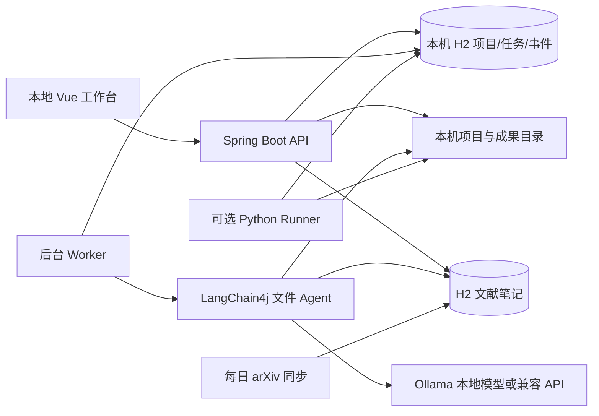

> [返回项目首页](../README.md)

<h1 align="center">research_agent · 详细使用指南</h1>

<p align="center">
  <b>本地科研编程助手</b><br>
  创建科研项目，用自然语言下达代码任务，查看进度并保存成果。
</p>

<p align="center">
  <a href="#features">主要功能</a> ·
  <a href="#quickstart">快速开始</a> ·
  <a href="#stack">技术栈</a> ·
  <a href="#platforms">系统配置</a> ·
  <a href="#demo">在线演示</a>
</p>

> **科研项目、代码与实验，集中在一个工作区。** 无需注册登录，下载后即可在本机启动。支持 Ollama 本地模型与 OpenAI 兼容 API；以自然语言下达任务，审阅代码、批准运行并查看结果。默认 H2 文件存储，无需单独配置数据库。

## 📑 导航

1. [定位、主要功能和体验流程](#features)
2. [快速开始与模型配置](#quickstart)
3. [技术栈与运行架构](#stack)
4. [Windows、macOS、Linux 环境配置](#platforms)
5. [在线演示与常见问题](#demo)

---

<a id="features"></a>

## 💡 定位与主要功能

`research_agent` 面向个人科研工作：管理本地项目、描述代码需求、审阅任务步骤，再由 Agent 读取项目文件并生成独立的代码产物。模型负责推理与生成；项目负责把工作区、后台任务、过程记录和成果放在一起。

| 功能 | 用户可以做什么 |
| --- | --- |
| 项目与任务 | 创建科研项目，用自然语言提交任务，审阅、批准或取消任务 |
| 科研编程 | Agent 读取项目上下文，通过工具调用生成独立代码产物，在线查看并下载 |
| 资料与记忆 | 保存项目记忆、导入 PDF、订阅 arXiv，使用带来源的 BM25 检索获取相关片段 |
| 实验与结果 | 批准 Python 脚本运行，查看状态、日志、指标和 SVG 曲线，创建后续分析任务 |
| MCP 接口 | 让兼容的本机 MCP 客户端查询项目笔记、论文列表和实验结果 |

本机用户打开界面即可使用。数据保存在本机文件；`user_id=1` 是兼容旧数据库结构的内部值，不表示有用户系统。服务只应监听本机，不能把无认证的工作区接口直接暴露到公网。

### 使用示例

1. 打开项目页，创建“图像分类基线”，工作区路径留空。
2. 进入工作台，输入：“读取项目，生成 PyTorch 训练与验证脚本，并写出未验证的假设”。
3. 在项目记忆中写研究约束、添加带来源的笔记或设置 arXiv 主题；审阅并批准任务，查看检索事件、阶段进度、代码和总结。需要运行 Python 代码时显式开启 Runner，并再次确认具体脚本。

默认 `demo` 模式生成固定的 Python/Go 示例，不调用模型。`live` 模式可按要求生成其他语言的代码，具体质量取决于所用模型；生成代码不等于论文复现成功。

### 可选：本机运行生成的 Python 脚本

安装 Python 并确认 `python --version` 后，在 `.env` 设置 `RESEARCH_RUNNER_ENABLED=true`，重启后端。在任务产物中检查脚本，然后点击“准备实验运行”，核对命令与工作目录，确认后才会启动进程。可用 `RESEARCH_PYTHON_EXECUTABLE` 指定 Python 解释器。Runner 不通过 shell 拼接命令，限制单次运行 5 分钟、日志总量 1 MB；它仍不是安全沙箱，勿运行不可信代码。其他语言的生成不受影响，但当前 Runner 只支持 Python。

脚本可在任务产物目录写 `metrics.jsonl`（每行如 `{"step":1,"loss":0.5,"accuracy":0.8}`）或 `metrics.csv`（首行 `step,loss,accuracy`）。实验助手每秒读取本次运行的数值，最多取 1 MB、1000 行和 8 个指标；网页显示起始值、最新值、观测最优值，并可下载独立 SVG 曲线。统计摘要只描述已有数据，不判断模型是否真正优于基线。可以将摘要与日志草拟为下一项分析任务，仍需人工确认。

### 可选：每日论文

在项目工作台“每日论文”中填写英文主题并保存；可立即同步，也可打开每日 08:00 自动同步。自动同步只拉取 arXiv Atom 元数据、标题、链接和原始摘要，新论文自动加入项目笔记检索。也可手动上传文本型 PDF（10 MB、100 页以内），查看抽取的方法原文片段，再创建待确认的代码任务。扫描件需先 OCR；公式、图表和方法解释仍需人工核对。每次同步最多抓取 5 篇，并在连续请求间至少等待 3 秒。

### 真实实验案例

2026-10-06 已完成 [Ollama 实验反馈闭环](../examples/ollama-feedback-case/README.md)：真实模型生成标准库梯度下降脚本，人工批准后由 Java Runner 执行，Agent 调用实验观察工具读取实际指标并生成分析和下一步任务草稿。保存了脚本、指标、报告和工具事件；这是小型集成验证，不代表论文复现成功。

2026-10-06 已通过真实模型的小型生成与执行验证：标准库回归任务由模型生成，Java Runner 执行成功，loss 从 133 降至 0.0725；详见 [真实模型验证记录](./live-validation.md)。该案例展示模型生成、Java 执行和指标记录。

[Digits 分类基线](../examples/digits-baseline/README.md) 可在 CPU 上实际训练，不需要模型密钥。三随机种子、固定训练/验证/测试划分、验证损失早停，输出 JSONL 指标、统计结果、SVG 曲线与混淆矩阵。当前实测测试准确率均值 96.39%，同一数据划分上样本标准差为 0；仅代表这个基线与划分。脚本人工编写。在线 Demo 展示实测结果快照，运行环境和脚本 SHA256 可核对。Java Runner 真实运行该案例的烟测已通过。

真实模型任务请选择支持工具调用的 Ollama 或 OpenAI 兼容模型，并提供论文、数据和科研约束。运行 Python 前安装脚本依赖，将 RESEARCH_PYTHON_EXECUTABLE 指向对应环境。代码和实验结果均可在工作台审阅。

### MCP 只读工具

本机后端同时提供绑定单个项目的只读 MCP Streamable HTTP 接口：

```text
POST http://127.0.0.1:8123/api/mcp/projects/{projectId}
Content-Type: application/json
Accept: application/json, text/event-stream
MCP-Protocol-Version: 2025-03-26   # initialize 之后的请求
```

提供 `search_research_notes`、`list_collected_papers`、`list_experiments`、`inspect_experiment`，用于让兼容 MCP 的本机客户端读取项目知识与实验结果。它不提供命令执行、文件写入或跨项目访问；默认 Origin 白名单适用于本机前端。接口没有登录认证，不得改为公网监听。提交 JSON-RPC `initialize` 后可调用 `tools/list` 和 `tools/call`；当前不支持服务端推送/SSE 会话流。

---

<a id="quickstart"></a>

## ⚡ 快速开始：本机直接运行

### 1. 安装 JDK 21 与 Node.js 22

在终端确认：

```text
java -version   # 21
node -v         # v22.x
npm -v
```

项目自带 Maven Wrapper，无需安装全局 Maven。安装平台与 CPU 架构的具体选择见[系统配置](#platforms)。

### 2. 准备环境文件

在仓库根目录首次复制示例文件；已有 `.env` 时保留原文件。

Windows PowerShell：

```powershell
cd D:\project\Agent\research_agent
if (-not (Test-Path .env)) { Copy-Item .env.example .env }
```

macOS / Linux Bash：

```bash
cd /path/to/research_agent
if [ ! -f .env ]; then cp .env.example .env; fi
```

`.env.example` 默认是 `RESEARCH_AI_MODE=demo`。`.env` 被 Git 忽略，密钥不要放进前端或提交到仓库。启动脚本读取简单 `KEY=value`，请勿使用引号、行内注释或变量展开。

### 3. 启动 Java 后端

Windows PowerShell，在仓库根目录：

```powershell
.\scripts\start-backend.ps1
```

macOS / Linux Bash：

```bash
bash scripts/start-backend.sh
```

Windows 脚本在当前开发机上可发现相邻目录的便携 JDK；这个 JDK 不随仓库分发，其他电脑需要安装 JDK 21。后端默认监听 `127.0.0.1:8123`，首次运行会在 `data/research_agent.mv.db` 创建本地数据库，Flyway 自动建表。`data/` 不提交到 Git。

已有打包 jar 时，Windows 可运行 `./scripts/smoke-demo.ps1 -EnableRunner -SyncPapers` 做独立端到端演示：脚本临时在 18123 端口启动后端，使用独立 H2 数据库创建项目、记忆、笔记和任务，检查检索事件、Python 执行、arXiv 同步与产物，然后停止脚本创建的进程。省略两个开关可只验证离线任务链路。运行前先执行 `./mvnw.cmd -B -ntp verify`。

### 4. 启动 Vue 前端

另开一个终端：

```bash
cd frontend
npm ci
npm run dev -- --port 5173 --strictPort
```

依赖已安装且锁文件未改变时可省略 `npm ci`。打开 **http://localhost:5173**；无需注册登录。Vite 会把 `/api` 转发给本机后端。API 文档在 http://localhost:8123/api/doc.html，能力状态在 http://localhost:8123/api/research/health。停止时分别在两个终端按 `Ctrl+C`。

### 5. 开启真实模型生成（可选）

#### Windows 本机 Ollama：照着做即可

本机使用 Ollama 时，**不需要申请 API Key，也不需要重新下载已安装的模型**。Agent 要用“聊天模型”来推理和调用工具。建议先选 `qwen3:8b`：它支持工具调用，而且已在本项目中实际验证。

1. 打开 PowerShell，查看电脑上已下载的模型：

   ```powershell
   ollama list
   ```

   你会看到类似 `qwen3:8b` 的模型名称。若命令提示找不到 Ollama，先安装并启动 Ollama 桌面程序，再重新打开 PowerShell。本机服务地址通常是 `http://127.0.0.1:11434`。

2. 确认 Ollama 服务能访问：

   ```powershell
   Invoke-RestMethod http://127.0.0.1:11434/api/tags
   ```

   如果能显示模型列表，继续下一步。如果连接失败，先从 Windows 开始菜单打开 Ollama，再运行这条命令。

3. 在仓库根目录打开配置文件：

   ```powershell
   notepad .env
   ```

   找到并改成下面这些配置。**保留 `.env` 里的其他设置**，不要把配置贴到 Vue 前端；`LLM_API_KEY` 留空即可。

```dotenv
RESEARCH_AI_MODE=live
LLM_PROVIDER=ollama
LLM_API_KEY=
LLM_BASE_URL=http://127.0.0.1:11434/v1
LLM_MODEL=qwen3:8b
```

4. 保存 `.env`，在运行后端的 PowerShell 窗口按 `Ctrl+C` 停止旧服务，然后重新启动：

   ```powershell
   .\scripts\start-backend.ps1
   ```

   `.env` 只在后端启动时读取；修改后要重启后端才生效。前端继续按上面的步骤运行。

5. 在网页中新建科研项目并提交一个小任务，批准后等待完成。成功时，任务事件会显示模型 `qwen3:8b`、提供方 `ollama` 和工具调用记录；代码会写入任务独立产物目录，不会覆盖原项目。

如果 `ollama list` 中没有 `qwen3:8b`，可在 PowerShell 下载一次：

```powershell
ollama pull qwen3:8b
```

该模型约 5 GB，下载耗时取决于网络；已经存在时不要重复下载。Ollama 与 LangChain4j 使用兼容接口，模型需支持工具调用；Ollama 官方列出了 Qwen 3 等支持工具的模型。[Ollama 工具调用说明](https://ollama.com/blog/streaming-tool)。

<a id="server"></a>

#### 部署到自己的服务器

Java 后端与 Vue 前端可以在 Linux 服务器运行；原生部署按上面的 Bash 命令启动，科研程序使用服务器上的 Python 环境、依赖与工作目录。仓库提供 Dockerfile、compose.yaml 与 Nginx 代理配置；默认 Compose 网页端口绑定服务器的 127.0.0.1，可通过 SSH 转发或受保护的反向代理访问。没有用户隔离时，不要把该入口当作多用户平台直接开放。

容器版默认打包 Java 工作台运行环境。运行 Python 实验前，还需在后端镜像中安装解释器与实验依赖，向 Compose 后端传入 RESEARCH_RUNNER_ENABLED / RESEARCH_PYTHON_EXECUTABLE，并挂载明确的实验目录；当前 .env 的 Runner 开关没有自动透传至 Compose。H2 与工作区保存在 research-data 卷；部署到服务器后不会自动读取访客电脑文件。

在服务器安装并启动 Ollama，下载一个支持工具调用的聊天模型；把上面五项配置写进服务器上的 `.env`，并将 `LLM_BASE_URL` 改为 **Java 后端所在主机/容器能够访问的 Ollama 地址**。Java 与 Ollama 在同一台非容器主机时可用 `http://127.0.0.1:11434/v1`；Java 在 Docker 容器中时，`127.0.0.1` 指向 Java 容器自身，必须改为容器网络中的 Ollama 服务名或宿主机可达地址。无需开放 Ollama 到公网，只需让后端能访问它。此仓库当前未验证容器化 Ollama 部署。

#### 常见问题

- **连接 Ollama 失败：**确认 Ollama 已启动，并在运行 Java 后端的那台机器上访问 `LLM_BASE_URL` 对应服务。
- **模型不存在：**运行 `ollama list`，把 `.env` 的 `LLM_MODEL` 改成列表里的完整名称（含标签），或执行一次 `ollama pull 模型名称`。
- **模型没有调用工具：**确认选的是聊天模型且支持工具调用；优先用本项目验证过的 `qwen3:8b`。`bge-large` 这类嵌入模型不能用于 Agent 对话。

兼容云端 API 的配置示例：

```dotenv
RESEARCH_AI_MODE=live
LLM_PROVIDER=openai-compatible
LLM_API_KEY=your-private-key
LLM_BASE_URL=https://api.deepseek.com
LLM_MODEL=deepseek-chat
```

默认地址和模型只是配置示例，真实调用及生成质量要用你自己的密钥验证。前端不持有密钥。代码生成后可显式开启 Runner，经审批运行 Python 脚本。

---

<a id="stack"></a>

## 🧰 技术栈

| 部分 | 当前主链路 | 职责 |
| --- | --- | --- |
| 界面 | Vue 3、TypeScript、Vite、Ant Design Vue、Axios、SSE | 项目、任务、进度与成果展示 |
| 后端 | Java 21、Spring Boot 3.5.4、JdbcTemplate、Flyway | 本地 API、文件边界、任务与后台 Worker |
| Agent | LangChain4j、Prompt、AiServices、文件 Tool Calling；Ollama 或 OpenAI 兼容模型 | 在限定工作区读取上下文、写入任务成果 |
| 项目知识 | 工作区 Markdown 记忆、H2 文档与分块、BM25 | 按任务找相关片段并附来源，按项目组织科研 RAG |
| 论文源 | Java HttpClient、arXiv Atom API、Spring 定时任务、PDFBox 3.0.5 | 主题订阅、摘要入库、文本型 PDF 抽取 |
| 实验运行 | Java ProcessBuilder、H2 运行记录、指标解析、SVG | 人工确认后执行 Python 脚本，监看日志与数值并导出曲线 |
| 本地数据 | 嵌入式 H2 文件数据库、工作区目录 | 保存项目、任务、事件和生成文件；不需要单独启动数据库服务 |
| 构建与验证 | Maven Wrapper、JUnit、Vue 类型检查；可选 Docker Compose + Nginx | 构建、集成测试与本机容器体验 |

科研资料按约 900 字符重叠分块，持久化到 H2，并在项目范围内用 BM25 检索；结果带文档与片段编号，供 Agent 查询。PDFBox 负责 PDF 文本抽取，只读 MCP 接口提供同项目的知识与实验查询。

### 运行架构



任务状态是 `WAITING_APPROVAL → QUEUED → RUNNING → SUCCEEDED/FAILED`，并支持取消。关闭浏览器不会取消后台生成或实验运行；重启服务时，运行中的记录标为 `INTERRUPTED`，不会自动恢复。文件工具拒绝越界路径和符号链接，生成结果单独存放，不自动覆盖原项目。

---

<a id="platforms"></a>

## 💻 不同电脑如何配置

| 系统 | 安装和设置 | 启动命令 |
| --- | --- | --- |
| Windows 10/11，Intel/AMD x64 | 安装 x64 JDK 21、Node.js 22；设置 `JAVA_HOME`，将 JDK `bin` 加入 `PATH` | PowerShell 运行 `.\scripts\start-backend.ps1`；另开终端运行前端命令 |
| macOS，Intel | 安装 x64 JDK 21、Node.js 22；确认终端可找到 `java` | `bash scripts/start-backend.sh`；另开终端运行前端命令 |
| macOS，Apple Silicon（M 系列） | 安装 ARM64/aarch64 JDK 21、Node.js 22，避免与 x64 工具混用 | 同上 |
| Linux，x64 / ARM64 | 安装与 CPU 架构匹配的 JDK 21、Node.js 22 | 同上 |
| Windows ARM / 其他设备 | 按架构选择 JDK/Node | 先确认工具链兼容，再按对应系统执行 |

安装来源：[JDK 21](https://adoptium.net/temurin/releases/?version=21)、[Node.js](https://nodejs.org/en/download)。重新打开终端检查 `java -version` 和 `node -v`。按电脑 CPU 架构选择工具链，运行下方命令确认环境。平台本身不需要 Python、Go、GPU 或 CUDA；以后运行具体科研程序时才需要相应语言与计算环境。

PowerShell 若阻止启动脚本，确认脚本内容后可仅为本次进程运行：

```powershell
powershell -NoProfile -ExecutionPolicy Bypass -File .\scripts\start-backend.ps1
```

### 可选：用 Docker 在本机体验

Docker 只是打包后端、前端和持久化数据的一种方式，**个人开发不需要它**。安装 Docker Desktop/Engine 和 Compose v2 后，在仓库根目录运行：

```bash
docker compose up -d --build
docker compose ps
```

访问 **http://localhost:8080**。Compose 只包含前端和后端，使用 `research-data` 卷保存 H2 数据和工作区；没有 MySQL/Redis 容器。端口默认仅绑定 `127.0.0.1`。`docker compose stop` 停止服务，不会删除数据卷。

Docker 中的工作区位于容器数据卷内，不能自动读取宿主机任意科研目录。若今后需要接管本机已有项目，应明确挂载并遵守工作区限制；当前最方便的本机使用方式是直接运行 Java + Vue。


---

<a id="demo"></a>

## 🌐 在线演示

**在线演示：[打开 research_agent Demo](https://zhuanglaihong.github.io/research_agent/)。** GitHub Pages 已部署；2026-10-06 验证页面可访问及固定交互流程。

在 /#/demo 选择科研案例，逐条推进对话或自动演示；右侧联动代码、运行记录、指标和可拖动流程画布。回复支持 Markdown 方法说明、参数表和代码建议，并提供可折叠的思考与执行分析摘要。Ollama 案例可展开实际工具事件、生成脚本与终端输出，点击记录跳转到对应文件或指标。二次优化和 Digits 使用实测记录，方法规划使用教学示例。会话回放不连接模型、不执行新实验；真实任务请启动本地工作台。

推送到 GitHub 且核对源码授权后，仓库所有者在 **Settings → Pages → Build and deployment → Source** 选择 **GitHub Actions**。然后在 **Actions** 打开 `Publish static research_agent demo`，点击 **Run workflow → main → Run workflow**。等待 build/deploy 两个 job 成功，再打开上面的预期地址，确认“创建示例任务→确认→查看固定指标”按钮可用。工作流以 `/${repo-name}/` 为资源前缀构建 `frontend/dist`；前端或 Pages 工作流变更推送 main 后会自动重新部署，也可手动运行。依据：[GitHub Pages 自定义工作流说明](https://docs.github.com/en/pages/getting-started-with-github-pages/using-custom-workflows-with-github-pages)。

**部署范围：**默认个人本机使用。实验在配置的工作区执行；不要把无认证的工作区接口直接暴露到互联网。GitHub Pages 提供浏览器演示，不托管科研运行环境。

## ✅ 验证与常见问题

```powershell
# Windows：后端科研测试与打包
.\mvnw.cmd -B -ntp verify
```

```bash
# macOS/Linux：后端科研测试与打包
bash mvnw -B -ntp verify
```

前端在 frontend/ 运行 npm run build。使用上述 Maven 命令运行后端测试并打包；实验样例包含代码、环境说明和原始指标，便于核对运行结果。

| 情况 | 处理 |
| --- | --- |
| `java` 或 `node` 找不到 | 检查 JDK 21、Node 22 的安装目录、`JAVA_HOME` 和 `PATH`，重新打开终端 |
| 8123 / 5173 端口占用 | 检查现有进程；前端默认端口应保持 5173，以匹配代理配置 |
| 首次启动失败 | 查看后端错误；确认 `data/` 可写，避免两个后端进程同时打开同一个 H2 文件 |
| `demo` 生成固定内容 | 这是预期；在 `.env` 设置 `live`、密钥和支持工具调用的模型后重启 |
| 代码未在原项目出现 | 成果写入独立任务目录，在工作台查看或下载 ZIP；目前不会自动改原仓库 |
